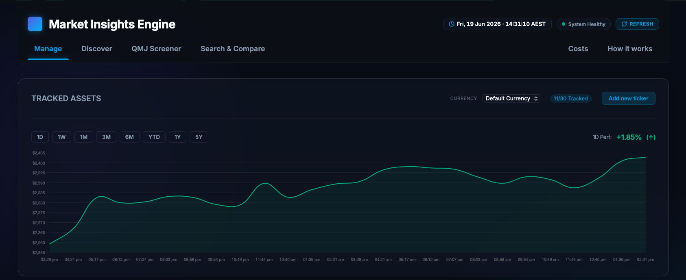
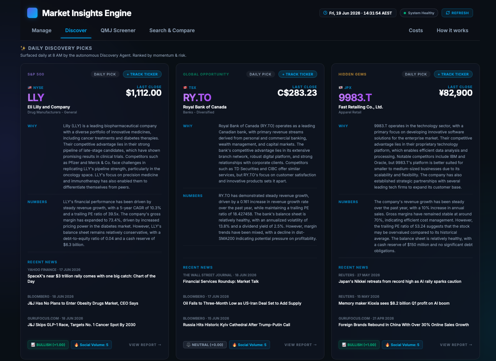
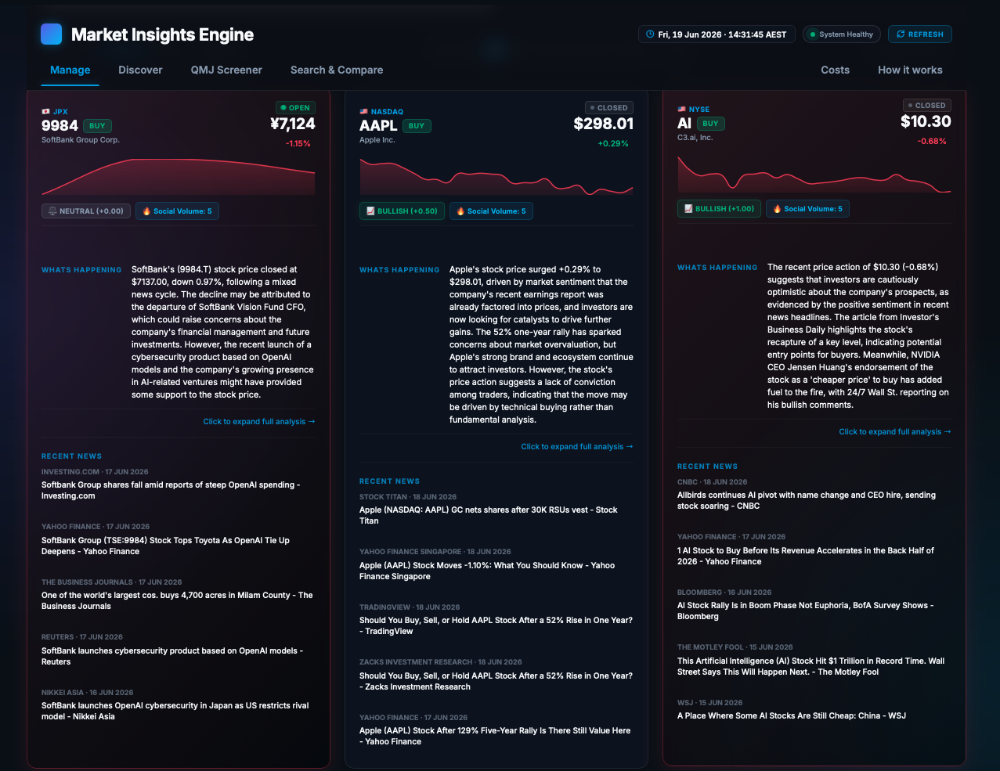
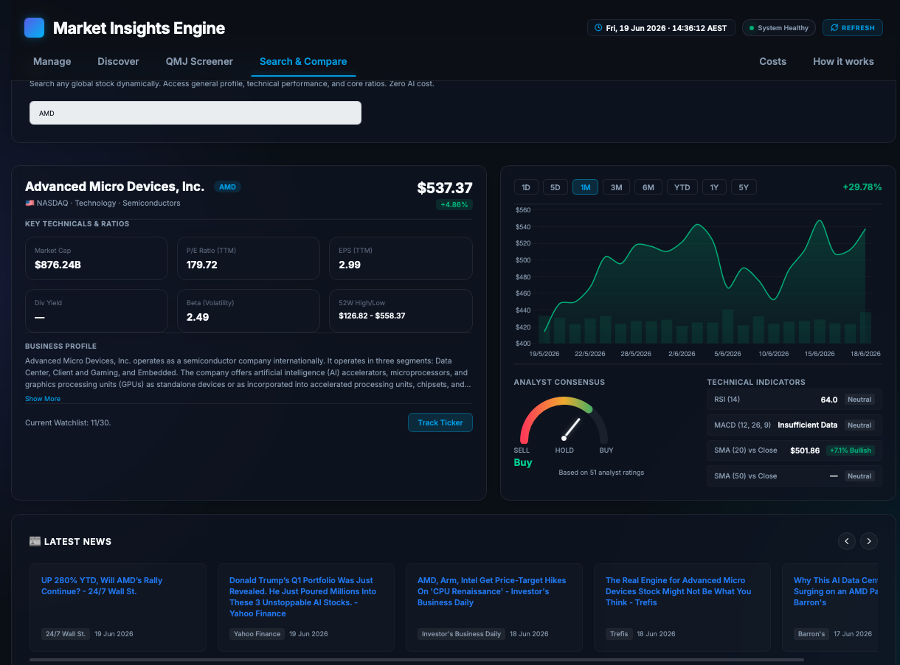
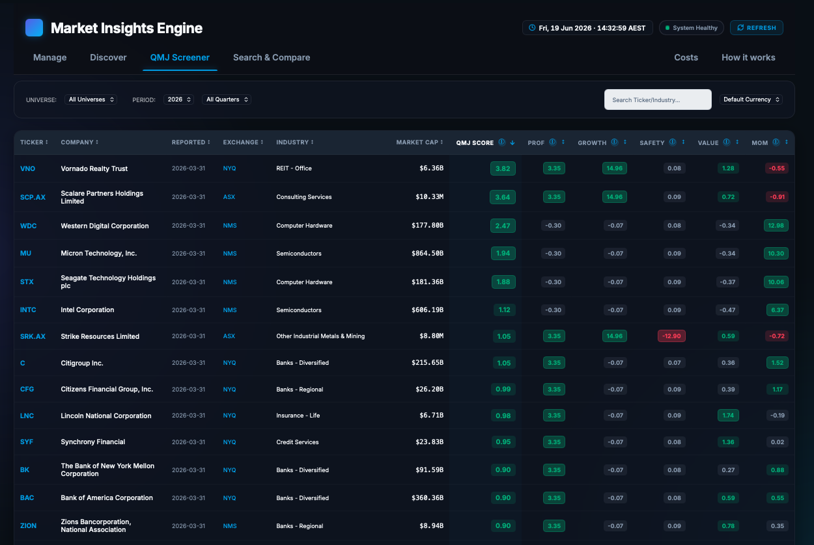
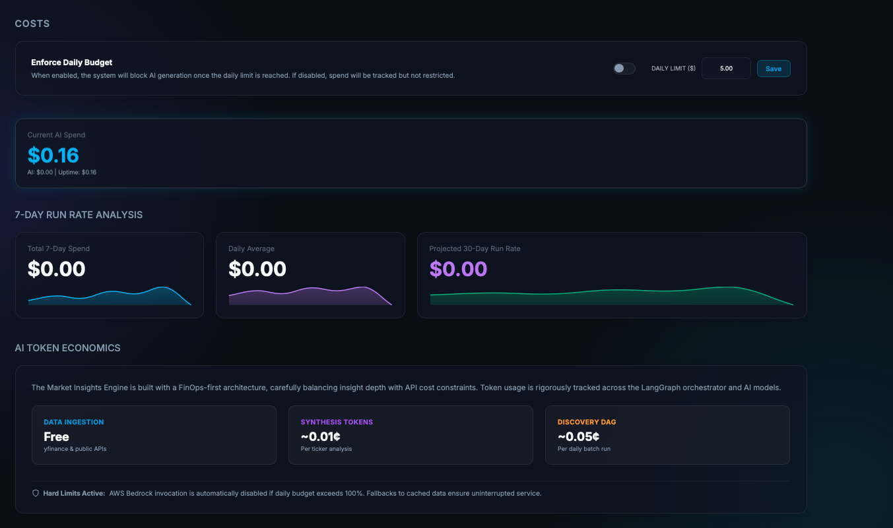
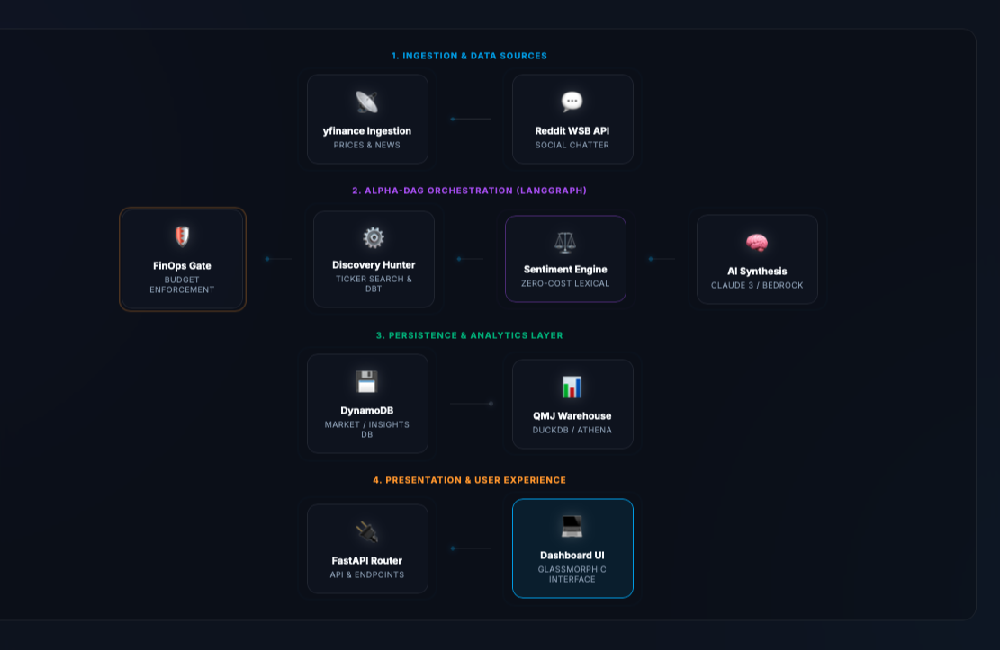
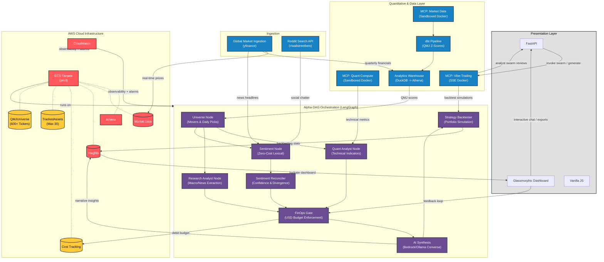

# Cost-Aware Market Insights Engine

A fully containerized Python (FastAPI) application designed to ingest stock market data, synthesize it using AI, and surface those insights on a premium frontend dashboard—all while rigorously enforcing strict financial guardrails (FinOps) to guarantee AI generation costs never exceed a daily budget.

The dashboard is structured around three core views:
- **Manage** — A high-signal, institutional-grade terminal focused on a **curated watchlist** (Max 30 assets). Features live sparklines, AI synthesis signals, and 24-hour momentum tracking.
- **Screener** — A quantitative powerhouse ranking **600+ tickers** across the S&P 500 and ASX universes using the **Quality Minus Junk (QMJ)** factor model, updated quarterly.
- **Discover** — Global market briefing room: regional indices, commodities, top daily movers, and an hourly news feed.
- **Costs / How it Works** — FinOps observability and architecture education.

## Dashboard Preview

### Manage & Tracked Assets


### Global Discovery & News



### Search & Compare


### Quantitative Screener (QMJ)


### FinOps & Architecture



## System Architecture




## Overview & Architecture Highlights

The **Cost-Aware Market Insights Engine** is a professional-grade, autonomous financial intelligence platform. It combines agentic AI orchestration (via LangGraph) with a high-performance analytical warehouse (dbt + DuckDB) to provide deep-dive market insights while maintaining strict enterprise-grade budget guardrails.

The engine has now evolved into a **Global Quality Screener**, specializing in **Quality Minus Junk (QMJ)** factor analysis across the S&P 500 and ASX universes.

### 🚀 Key Capabilities

*   **Institutional Dashboard Pivot**: Optimized for high-signal monitoring of elite assets (FAANG by default), decoupling active tracking from broad-market discovery.
*   **Global Discovery Engine (3-Category Model)**: Transformed into a high-conviction global intelligence engine.
    *   **S&P 500 Leader**: Surfacing elite US mega-cap opportunities.
    *   **Global Opportunity**: Expanding into international markets (ASX, LSE, HKEX, NSE, TSX).
    *   **Hidden Gem**: Identifying high-potential mid-cap "quality" candidates.
*   **Autonomous Auto-Healing & Resilience**: A persistent frontend loop monitors AI synthesis states and triggers targeted refinement to ensure analysis is always available without human intervention.
*   **Cost-Aware Targeted Refresh**: Separates cheap real-time market data refreshes (manual button) from expensive AI synthesis (autonomous healing), optimizing token spend.
*   **Institutional Global Dashboard**: Side-by-side comparison across 5+ global exchanges with normalized currency and automated FX conversion.
*   **Agentic Orchestration (Alpha-DAG)**: A multi-agent system powered by LangGraph that autonomously "hunts" for high-quality market opportunities.
*   **FinOps Budget Gates**: Mandatory pre-flight budget checks in the DAG ensure LLM spend never exceeds your daily threshold.
*   **Multi-Provider LLM Routing**: Unified routing engine with priority fallback — Ollama → OpenAI → Anthropic → Bedrock Converse API. Zero single-provider lock-in.
*   **Lexical Social Sentiment**: $0-cost, dictionary-based scoring of Reddit WSB posts, news headlines, and recent tweets (via X API v2). Live sentiment badges (📈/📉/⚖️) and social volume counters on every watchlist card and discovery pick.
*   **System Developer Logs Console**: Real-time developer terminal console built into the bottom-right of the dashboard UI. Polls a thread-safe local ring buffer to display real-time backend events (scheduler ticks, ingestion steps, AI synthesis results) without CloudWatch cost overheads.
*   **TradingView-UX**: High-density, scrollable terminal dashboard with 24-hour sparklines, multi-timeframe charts, and extended-hours visibility.
*   **Analytics Warehouse**: dbt-driven data lakehouse architecture for scalable, reproducible financial modeling.

For a deep dive into the system network design and future Cloud integration plans, review the full [System Design Documentation](./system-design/system_overview.md).

## Quality Minus Junk (QMJ) Methodology

The QMJ Screener evaluates fundamental financial strength based on the "Quality Minus Junk" framework, using data extracted from `yfinance`. The system calculates proxy metrics since standard API data is limited compared to institutional datasets.

**Scoring Methodology:**
Scores are calculated via `dbt` and `DuckDB` (local) or `Athena` (production), converting raw metrics into percentiles (1-100) across the tracked universe using SQL `PERCENT_RANK()`.

1.  **Profitability Score (50%)**: Identifies companies with strong return on capital and cash generation.
    *   *Return on Equity (ROE)*: `net_income / total_stockholder_equity`
    *   *Return on Assets (ROA)*: `net_income / total_assets`
    *   *Cash Flow Margin*: `operating_cash_flow / total_revenue`
2.  **Safety Score (50%)**: Identifies companies with low leverage and default risk.
    *   *Leverage Ratio (Inverse)*: `total_assets / total_debt`

**Total QMJ Score** = `(Profitability Percentile + Safety Percentile) / 2`


## Sentiment Analysis Framework

To provide real-time, qualitative market intelligence without incurring AI API costs, the engine runs an automated, zero-cost **Lexical Sentiment Pipeline**. It cross-references retail chatter, news headlines, and microblogging posts to capture market mood:

*   **Reddit Ingestion (`r/wallstreetbets`)**: The engine queries the public search API for the last 15 posts matching the ticker, extracting post titles and content to capture active retail sentiment.
*   **X (Twitter) Ingestion**: Under Phase 10 multi-agent sentiment reconciliation, a feature-flagged X API adapter scans posts for real-time microblogging market trends (up to 15 posts, degrades dynamically if disabled or credentials/bearer tokens are missing).
*   **News Integration**: Headline text from either the active synthesis queue or `yfinance` fallback is merged with social data to enrich the textual context.
*   **Tokenization & Matching**: All collected text is normalized and tokenized. Words are checked against predefined financial dictionaries containing optimistic/bullish words and risk-focused/bearish words.

### 1. Retail Sentiment Index Score Formula

$$\text{Score} = \frac{\text{Pos} - \text{Neg}}{\text{Pos} + \text{Neg}}$$

Calculates the normalized ratio of bullish terms (**Pos**) to bearish terms (**Neg**). The resulting score spans from **-1.00 (Maximum Bearish)** to **+1.00 (Maximum Bullish)**.

### 2. Classification Boundaries & Social Volume

*   **📈 Bullish**: Sentiment Score $> +0.12$
*   **📉 Bearish**: Sentiment Score $< -0.12$
*   **⚖️ Neutral**: Sentiment Score between $-0.12$ and $+0.12$

**Social Volume**: The absolute count of active post matches, news headlines, and recent tweets aggregated in the calculation window across active sources (displayed on the dashboard as `🔥 Social Volume: [Count]`).


## System Requirements & Prerequisites

To ensure the engine runs successfully in a local or cloud environment, verify the following prerequisites:

### 1. Core Runtime
- **Python 3.11+**: The application leverages modern typing features and async patterns.
- **Docker & Docker Compose**: Essential for orchestrating the DynamoDB ledger, FastAPI container, and Vibe-Trading MCP service.
- **Node.js (Optional)**: Only required if you intend to run standalone frontend build tools.

### 2. AWS Infrastructure (Production)
- **AWS Account**: Required for DynamoDB (Insights/Market) and Bedrock.
- **AWS CLI (`aws`)**: Configured with valid credentials (`aws configure`) and appropriate IAM permissions for DynamoDB, S3, and Bedrock.
- **Bedrock Model Access**: **CRITICAL.** You must manually request access to the `Anthropic Claude 3 Haiku` model in the AWS Bedrock console (e.g., in `us-east-1` or `us-west-2`). Access is typically granted within minutes but is not enabled default. The engine uses the **Bedrock Converse API** (`converse` endpoint) — ensure your IAM role has `bedrock:InvokeModel` and `bedrock:Converse` permissions.

### 3. Local Intelligence (Development)
- **Ollama**: Required if running without AWS Bedrock.
- **Llama 3.2**: The default recommended model for the Discovery Agent logic. Ensure you have run `ollama pull llama3.2` before starting the app.

### 4. Financial Data Access & Internet Connectivity
- **Active Internet Connection**: **CRITICAL.** Even when running in local offline development using Ollama, the application requires outbound HTTPS access to `query1.finance.yahoo.com` and other web APIs for data ingestion, global news feed parsing, and running MCP strategy backtests. Outbound connections must not be blocked by network firewalls.


## Environment & LLM Support

The engine is designed for **Multi-LLM portability**, allowing you to run powerful open-source models locally during development and scale to enterprise-grade models in the cloud.

> [!NOTE]
> **Environment Context Rule**:
> - **Local Runs**: Defaults to using the local model (`ollama` / `Llama 3.2`) to save costs, but **still requires active internet connectivity** to fetch market data and perform backtests.
> - **Cloud Deployments**: Automatically maps to the cloud model (`bedrock` / `Claude 3 Haiku`) for high-availability enterprise synthesis.

| Environment | LLM Provider | Model | Cost | Setup Complexity |
| :--- | :--- | :--- | :--- | :--- |
| **Local (Free)** | `ollama` | Llama 3 / 3.2 | Free | Low |
| **Cloud (AWS)** | `bedrock` | Claude 3 Haiku (Converse API) | Pay-as-you-go | Medium |
| **Cloud (OpenAI)** | `openai` | GPT-4o / GPT-4o-mini | Pay-as-you-go | Low |
| **Cloud (Anthropic)** | `anthropic` | Claude 3.x | Pay-as-you-go | Low |
| **Local (Zero-Effort)** | `mock` | Static Mock | Free | Zero |

---

## Quick Start (Running Locally with Ollama)

To run the engine on your local machine using an open-source LLM:

1. **Install Ollama**: Download from [ollama.com](https://ollama.com/) and run it.
2. **Pull a model**:
   ```bash
   ollama pull llama3.2
   ```
3. **Clone the repository**:
   ```bash
   git clone https://github.com/Cost-Aware-Market-Insights-Engine.git
   cd Cost-Aware-Market-Insights-Engine
   ```
4. **Configure for Local Run**:
   - **Main App**: Set `LLM_PROVIDER=ollama` and `OLLAMA_MODEL=llama3.2` in your local `.env` file.
   - **Vibe-Trading MCP Swarms**: Edit the `vibe-trading-mcp` service environment block in [docker-compose.yml](file:///Users/andrewpham/Documents/GitHub/Cost-Aware-Market-Insights-Engine/docker-compose.yml) to swap the default `mock` settings:
     ```yaml
           - LANGCHAIN_PROVIDER=ollama
           - LANGCHAIN_MODEL_NAME=llama3.2
           - OLLAMA_BASE_URL=http://host.docker.internal:11434
     ```
5. **Start the containers**:
   ```bash
   docker-compose up -d --build
   ```
6. **Verify Container Health**:
   Ensure both the core FastAPI app and the `vibe-trading-mcp` service are up and healthy:
   ```bash
   docker-compose ps
   ```
7. **Initialize the QMJ Screener**:
   The engine uses dbt Core to calculate analytical scores. Run the following once to set up your local DuckDB instance:
   ```bash
   cd src/dbt_qmj
   dbt run
   cd ../..
   ```
8. **Access the Dashboard**: [http://localhost:8000](http://localhost:8000)

---

## Analytical Warehouse Setup (dbt)

The platform utilizes an **Open Data Lakehouse** pattern. For local development, it uses **DuckDB** which requires no infrastructure.

### Local Development (DuckDB)
The `WarehouseClient` automatically detects your local environment. To update the QMJ scores after adding new tickers:
```bash
cd src/dbt_qmj && dbt run
```

### Production Deployment (AWS Athena)
To enable the cloud-scale warehouse:
1. Set `USE_ATHENA=true` in your environment.
2. Provide your `S3_DATALAKE_BUCKET` name.
3. dbt will automatically route transformations to **AWS Athena** over your S3 data lake.

---

## AWS Production Deployment (Cloud)

To deploy the stack to AWS using Amazon Bedrock for the main app and a cloud provider (e.g. OpenAI, Gemini, or DeepSeek) for the multi-agent swarms:

1. **Prerequisites**:
   - AWS Account with **Amazon Bedrock** access requested for `Claude 3 Haiku`.
   - AWS CLI configured (`aws configure`).
2. **Configure Core App**:
   Set `LLM_PROVIDER=bedrock` in your production environment variables (e.g. in your task definition or container environment).
3. **Configure Vibe-Trading MCP (Cloud)**:
   Since the `vibe-trading-mcp` service leverages standard LangChain model factories requiring OpenAI-compatible or direct cloud API connections, configure its environment variables for a cloud LLM provider:
   - **For OpenAI**:
     ```yaml
     - LANGCHAIN_PROVIDER=openai
     - LANGCHAIN_MODEL_NAME=gpt-4o-mini
     - OPENAI_API_KEY=your_openai_api_key
     ```
   - **For Gemini**:
     ```yaml
     - LANGCHAIN_PROVIDER=gemini
     - LANGCHAIN_MODEL_NAME=gemini-1.5-flash
     - GEMINI_API_KEY=your_gemini_api_key
     ```
   - **For DeepSeek**:
     ```yaml
     - LANGCHAIN_PROVIDER=deepseek
     - LANGCHAIN_MODEL_NAME=deepseek-chat
     - DEEPSEEK_API_KEY=your_deepseek_api_key
     ```
4. **Deploy Infrastructure**:
   ```bash
   sh scripts/deploy.sh
   ```
   *This builds an ARM64-optimized production image, pushes it to ECR, and updates the CloudFormation stack (Fargate + DynamoDB).*
5. **Teardown**:
   ```bash
   sh scripts/teardown.sh
   ```

---

## Configuration Reference

The application behavior is controlled via environment variables (see `src/config.py`):

| Variable | Description | Default |
| :--- | :--- | :--- |
| `LLM_PROVIDER` | `mock`, `ollama`, or `bedrock` | Auto-detected |
| `ENVIRONMENT`  | `local` or `production` | `local` |
| `LOG_LEVEL` | Backend log level (`DEBUG`, `INFO`, `WARNING`, `ERROR`) | Auto (`DEBUG` local / `INFO` production) |
| `OLLAMA_URL` | Endpoint for Ollama API | `http://host.docker.internal:11434` |
| `OLLAMA_MODEL` | Local model to invoke | `llama3.2` |
| `DAILY_BUDGET_USD` | Hard cap on AI spend (Default if DB is empty) | `5.00` |
| `TICKERS` | Comma-separated list of symbols | `AAPL,MSFT,GOOGL,AMZN,META` |
| `DYNAMODB_ENDPOINT_URL`| Point to local DynamoDB (local only) | `None` |

> **Note on Auto-Detection:** If `LLM_PROVIDER` is left blank, the engine will automatically switch to `bedrock` when running in AWS (detected via `AWS_EXECUTION_ENV`) or when `ENVIRONMENT=production`. Otherwise, it defaults to `ollama`.
>
> **Developer Logs Tip:** The in-dashboard Developer Logs Console reflects the backend log stream and now includes `DEBUG` events when `LOG_LEVEL=DEBUG` (default in local mode).

## Project Structure

```text
├── docker-compose.yml       # Local execution with DynamoDB-local and Vibe-Trading MCP
├── Dockerfile               # Multi-stage production environment (ARM64)
├── requirements.txt         # App dependencies (FastAPI, LangGraph, MCP, vibe-trading-ai, etc.)
├── scripts/                 # DevOps automation for AWS Deploy/Teardown
│   ├── docker-entrypoint.sh # Docker startup entrypoint script running syntax check
│   └── syntax_check.sh      # Python, JS, and Docker Compose syntax validator
├── static/                  # Glassmorphic frontend dashboard with Research Lab tab
├── src/                     # Core Alpha-DAG application logic
│   ├── main.py              # Entrypoint & 8 AM AEST Scheduler
│   ├── dag/                 # LangGraph orchestration (Movers, Sentiment, Backtest)
│   ├── mcp/                 # Market Data and Quant Compute MCP servers
│   ├── clients/             # Bedrock, DynamoDB, DuckDB, and Vibe MCP clients
│   ├── cost_tracking/       # FinOps logic and budget gates
│   └── routes/              # Client-facing API v1/v2 endpoints
│       ├── discover.py      # Market indices, movers & news endpoints
│       ├── chat.py          # Interactive analyst swarm chatbot and strategy exporters
│       └── meta.py          # Exchange rates endpoint
└── system-design/           # Architecture diagrams and system overview
```

### 🛡️ Automatic Syntax Checks
The Docker configuration automatically executes `./scripts/syntax_check.sh`:
1. **During Build (`docker build`)**: Validates the Python and JavaScript code within the image. Any syntax errors block the image creation process.
2. **On Container Startup/Redeployment**: An entrypoint wrapper script runs validation before initiating the FastAPI server (`uvicorn`). If any file is corrupted or contains syntax errors, the container exits, preventing traffic routing and triggering rollbacks.

## Technical Constraints & Data Policy

*   **Discovery Timeframe Standardization**: The "Discover" engine standardizes on a **3-Month (3M)** minimum timeframe for all sparkline visualizations. This ensures high-density trend lines using stable daily price series.
*   **Intra-Day Commodity Gaps**: High-resolution (1D/1W) data for commodities (e.g., Gold, Oil) is currently unavailable in the local development environment due to API resolution constraints. These shorter timeframes have been deprecated in the Discovery dashboard to maintain system-wide data integrity.

## Phased Rollout Roadmap
- **[COMPLETE] Phase 1: Monolithic System** - Built the foundational FastAPI backend, local DynamoDB ledger, FinOps constraints, and glassmorphic UI.
- **[COMPLETE] Phase 2: Alpha-DAG via MCP** - Deconstructed the monolith into a distributed system governed by a LangGraph orchestrator.
- **[COMPLETE] Phase 3: Daily Discovery Agent** - Integrated an autonomous agent that triggers at 8:00 AM AEST to select top daily picks.
- **[COMPLETE] Phase 4: UX Polish & Global Access** - Multi-currency support, interactive visualizations, live discovery pick hydration, and educational infrastructure animations.
- **[COMPLETE] Phase 5: Discover & Manage Redesign** - Restructuring the dashboard navigation into dedicated Manage (tracked assets) and Discover (global market intelligence) tabs. Adding regional indices, commodities, top movers, and a live news feed.
- **[COMPLETE] Phase 6: Global Localization & Resilience** - Multi-currency support (HKD, CAD, SGD, NZD), exchange-aware price formatting, and robust local LLM (Ollama) stability patches for the Discovery Agent.
- **[COMPLETE] Phase 7: Global Quality Screener & Institutional Pivot** - Integrated S&P 500 and ASX universe toggle for the QMJ Screener, implemented a resilient "permissive" ingestion engine with quarterly fallbacks, and executed an institutional pivot to focus the dashboard on FAANG assets while isolating the 600-ticker screener logic.
- **[COMPLETE] Phase 8: Discovery Stabilization & Timeframe Standardization** - Standardized the Discovery dashboard on a 3-month daily-data minimum to resolve high-frequency data regressions and MultiIndex parsing issues.
- **[COMPLETE] Phase 9: Multi-Provider LLM Routing & Lexical Sentiment Pipeline** - Integrated a provider-agnostic router (local Ollama fallback, OpenAI, Anthropic, Bedrock Converse) and zero-cost, dictionary-based sentiment scoring for Reddit & news with frontend sentiment badges.
- **[COMPLETE] Phase 10: Multi-Agent Collaborative Refinement & Reconciliation** - Added multi-source sentiment agents (Reddit + News + optional X), sentiment reconciliation before recommendation synthesis, and backward-compatible sentiment diagnostics in API responses.
- **[COMPLETE] Phase 11: Multi-Agent Swarm Research & Backtesting Integration** - Integrated HKUDS Vibe-Trading components: a containerized `vibe-trading-mcp` server, collaborative research swarms (macro, investment, risk, catalyst), interactive research chatbot in the UI, strategy artifact exporters (Pine Script, MT5, PDF), and a 3-month portfolio backtesting loop embedded in the Costs tab.

---

## Project Tracking

- **[Development Blog](./dev-blog/DEVELOPMENT_BLOG.md)** — Architectural pivots and engineering journals.
- **[Changelog](./CHANGELOG.md)** — Version-by-version feature updates and bug fixes.

---

## License
MIT License - See [LICENSE](LICENSE) for details.

---

[](https://ko-fi.com/waterbear9999)
