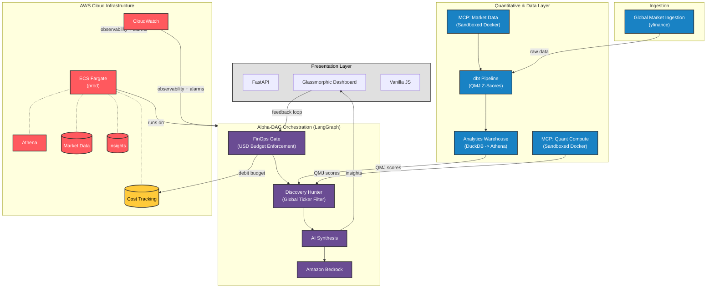

# Cost-Aware Market Insights Engine

A fully containerized Python (FastAPI) application designed to ingest stock market data, synthesize it using AI, and surface those insights on a premium frontend dashboard—all while rigorously enforcing strict financial guardrails (FinOps) to guarantee AI generation costs never exceed a daily budget.

The dashboard is structured around three core views:
- **Manage** — Track up to 30 assets with live sparklines, AI synthesis signals, and flexible grid layouts. Search, filter by exchange or country, and sort by price or change.
- **Discover** — A global market briefing room: regional indices, commodities, top daily movers, and an hourly news feed.
- **Costs / How it Works** — FinOps observability and architecture education.


## System Architecture



## Overview & Architecture Highlights

This project is built around the fundamental philosophy that AI integration must be cost-aware from day one. It utilizes a distributed **Alpha-DAG** system built with LangGraph and the Model Context Protocol (MCP) to ensure modularity, security, and strict financial control.

1. **Data Ingestion via MCP**: `yfinance` logic and Google News RSS extraction are decoupled into a dedicated Market Data MCP server.
2. **Quant Compute Sandbox**: Mathematical calculations (Pandas/Numpy) are executed in a strictly isolated, network-restricted MCP container with zero AWS credentials.
3. **LangGraph Orchestrator**: A Directed Acyclic Graph (DAG) routes tasks, maintains state, and sequences API calls to **AWS Bedrock (Anthropic Claude 3 Haiku)**.
4. **FinOps Engine (DynamoDB)**: An interceptor node in the LangGraph DAG estimates token costs, queries a local `CostTracking` ledger, and physically blocks execution if it would breach your `DAILY_BUDGET_USD` limit.
5. **Daily Discovery Agent**: An autonomous agent that triggers at 8:00 AM AEST to perform mass market analysis and surface "Hidden Gems" with **AI Smart Narratives** (3-bullet rationale with performance metrics).
6. **Global QMJ Screener**: An Open Data Lakehouse architecture (dbt Core + DuckDB/Athena) calculates Quality Minus Junk (QMJ) proxy scores (Profitability + Safety) to rank tracked assets.

For a deep dive into the system network design and future Cloud integration plans, review the full [System Design Documentation](./system-design/system_overview.md).

## Quality Minus Junk (QMJ) Methodology

The QMJ Screener evaluates fundamental financial strength based on the "Quality Minus Junk" framework, using data extracted from `yfinance`. The system calculates proxy metrics since standard API data is limited compared to institutional datasets.

**Scoring Methodology:**
Scores are calculated via `dbt` and `DuckDB` (local) or `Athena` (production), converting raw metrics into percentiles (1-100) across the tracked universe using SQL `PERCENT_RANK()`.

1.  **Profitability Score (50%)**: Identifies companies with strong return on capital and cash generation.
    *   *Return on Equity (ROE)*: `net_income / total_stockholder_equity`
    *   *Return on Assets (ROA)*: `net_income / total_assets`
    *   *Cash Flow Margin*: `operating_cash_flow / total_revenue`
2.  **Safety Score (50%)**: Identifies companies with low leverage and default risk.
    *   *Leverage Ratio (Inverse)*: `total_assets / total_debt`

**Total QMJ Score** = `(Profitability Percentile + Safety Percentile) / 2`


## System Requirements

- **Docker & Docker Compose**: The easiest way to spin up the local DynamoDB ledger alongside the application.
- **AWS Account**: Required for production deployment and invoking the **Amazon Bedrock (Anthropic Claude 3 Haiku)** models.
- **AWS CLI (`aws`)**: Must be configured with `aws configure` locally before running deployment scripts.
- **Python 3.12+**: Required for `langgraph` and `mcp` compatibility.
- **Model Subscriptions**: Ensure that you have requested access to `Anthropic Claude 3 Haiku` inside the AWS Bedrock console in your target region before going live.

## Environment & LLM Support

The engine is designed for **Multi-LLM portability**, allowing you to run powerful open-source models locally during development and scale to enterprise-grade models in the cloud.

| Environment | LLM Provider | Model | Cost | Setup Complexity |
| :--- | :--- | :--- | :--- | :--- |
| **Local** | `ollama` | Llama 3 / 3.2 | Free | Low |
| **Cloud (AWS)** | `bedrock` | Claude 3 Haiku | Pay-as-you-go | Medium |
| **Local (Quick)** | `mock` | Static Mock | Free | Zero |

---

## Quick Start (Running Locally with Ollama)

To run the engine on your local machine using an open-source LLM:

1. **Install Ollama**: Download from [ollama.com](https://ollama.com/) and run it.
2. **Pull a model**:
   ```bash
   ollama pull llama3.2
   ```
3. **Clone the repository**:
   ```bash
   git clone https://github.com/Cost-Aware-Market-Insights-Engine.git
   cd Cost-Aware-Market-Insights-Engine
   ```
4. **Configure for Local Run**:
   Edit `docker-compose.yml` and ensure `LLM_PROVIDER` is set to `ollama`.
5. **Start the containers**:
   ```bash
   docker-compose up -d --build
   ```
6. **Initialize the QMJ Screener**:
   The engine uses dbt Core to calculate analytical scores. Run the following once to set up your local DuckDB instance:
   ```bash
   cd src/dbt_qmj
   dbt run
   cd ../..
   ```
7. **Access the Dashboard**: [http://localhost:8000](http://localhost:8000)

---

## Analytical Warehouse Setup (dbt)

The platform utilizes an **Open Data Lakehouse** pattern. For local development, it uses **DuckDB** which requires no infrastructure.

### Local Development (DuckDB)
The `WarehouseClient` automatically detects your local environment. To update the QMJ scores after adding new tickers:
```bash
cd src/dbt_qmj && dbt run
```

### Production Deployment (AWS Athena)
To enable the cloud-scale warehouse:
1. Set `USE_ATHENA=true` in your environment.
2. Provide your `S3_DATALAKE_BUCKET` name.
3. dbt will automatically route transformations to **AWS Athena** over your S3 data lake.

---

## AWS Production Deployment (Cloud)

To deploy to AWS using Amazon Bedrock and Claude 3 Haiku:

1. **Prerequisites**:
   - AWS Account with **Amazon Bedrock** access requested for `Claude 3 Haiku`.
   - AWS CLI configured (`aws configure`).
2. **Configure for Cloud**:
   Set `LLM_PROVIDER=bedrock` in your production environment variables.
3. **Deploy Infrastructure**:
   ```bash
   sh scripts/deploy.sh
   ```
   *This builds an ARM64-optimized production image, pushes it to ECR, and updates the CloudFormation stack (Fargate + DynamoDB).*
4. **Teardown**:
   ```bash
   sh scripts/teardown.sh
   ```

---

## Configuration Reference

The application behavior is controlled via environment variables (see `src/config.py`):

| Variable | Description | Default |
| :--- | :--- | :--- |
| `LLM_PROVIDER` | `mock`, `ollama`, or `bedrock` | Auto-detected |
| `ENVIRONMENT`  | `local` or `production` | `local` |
| `OLLAMA_URL` | Endpoint for Ollama API | `http://host.docker.internal:11434` |
| `OLLAMA_MODEL` | Local model to invoke | `llama3.2` |
| `DAILY_BUDGET_USD` | Hard cap on AI spend (FinOps) | `5.00` |
| `TICKERS` | Comma-separated list of symbols | `AAPL,MSFT,GOOGL,AMZN,META` |
| `DYNAMODB_ENDPOINT_URL`| Point to local DynamoDB (local only) | `None` |

> **Note on Auto-Detection:** If `LLM_PROVIDER` is left blank, the engine will automatically switch to `bedrock` when running in AWS (detected via `AWS_EXECUTION_ENV`) or when `ENVIRONMENT=production`. Otherwise, it defaults to `ollama`.

## Project Structure

```text
├── docker-compose.yml       # Local execution with DynamoDB-local
├── Dockerfile               # Multi-stage production environment (ARM64)
├── requirements.txt         # App dependencies (FastAPI, LangGraph, MCP, pytz, etc.)
├── scripts/                 # DevOps automation for AWS Deploy/Teardown
│   └── syntax_check.sh      # Python, JS, and Docker Compose syntax validator
├── static/                  # Glassmorphic frontend dashboard
├── src/                     # Core Alpha-DAG application logic
│   ├── main.py              # Entrypoint & 8 AM AEST Scheduler
│   ├── dag/                 # LangGraph orchestration and Discovery Agent
│   ├── mcp/                 # Market Data and Quant Compute MCP servers
│   ├── cost_tracking/       # FinOps logic and budget gates
│   └── routes/              # Client-facing API v1/v2 endpoints
│       ├── discover.py      # Market indices, movers & news endpoints
│       └── meta.py          # Exchange rates endpoint
└── system-design/           # Architecture diagrams and system overview
```

## Phased Rollout Roadmap
- **[COMPLETE] Phase 1: Monolithic System** - Built the foundational FastAPI backend, local DynamoDB ledger, FinOps constraints, and glassmorphic UI.
- **[COMPLETE] Phase 2: Alpha-DAG via MCP** - Deconstructed the monolith into a distributed system governed by a LangGraph orchestrator.
- **[COMPLETE] Phase 3: Daily Discovery Agent** - Integrated an autonomous agent that triggers at 8:00 AM AEST to select top daily picks.
- **[COMPLETE] Phase 4: UX Polish & Global Access** - Multi-currency support, interactive visualizations, live discovery pick hydration, and educational infrastructure animations.
- **[COMPLETE] Phase 5: Discover & Manage Redesign** - Restructuring the dashboard navigation into dedicated Manage (tracked assets) and Discover (global market intelligence) tabs. Adding regional indices, commodities, top movers, and a live news feed.
- **[COMPLETE] Phase 6: Global Localization & Resilience** - Multi-currency support (HKD, CAD, SGD, NZD), exchange-aware price formatting, and robust local LLM (Ollama) stability patches for the Discovery Agent.
- **[COMPLETE] Phase 7: Global QMJ Screener** - Integrated an Open Data Lakehouse architecture (dbt Core + DuckDB/Athena) to rank assets by Quality Minus Junk (Profitability + Safety).
- **[COMPLETE] Phase 8: Scalable Infrastructure & UX Mastery** - Integrated S&P 500 and ASX universe toggle for the QMJ Screener, added an API-throttled Force Refresh system, and executed final UI/UX alignment passes.
- **[PLANNED] Phase 9: Multi-Agent Collaborative Refinement** - Introducing specialized "Sentiment Agent" nodes to ingest alternative data (Reddit/X).


---

## Project Tracking

- **[Development Blog](./dev-blog/DEVELOPMENT_BLOG.md)** — Architectural pivots and engineering journals.
- **[Changelog](./CHANGELOG.md)** — Version-by-version feature updates and bug fixes.

---

## License
MIT License - See [LICENSE](LICENSE) for details.
