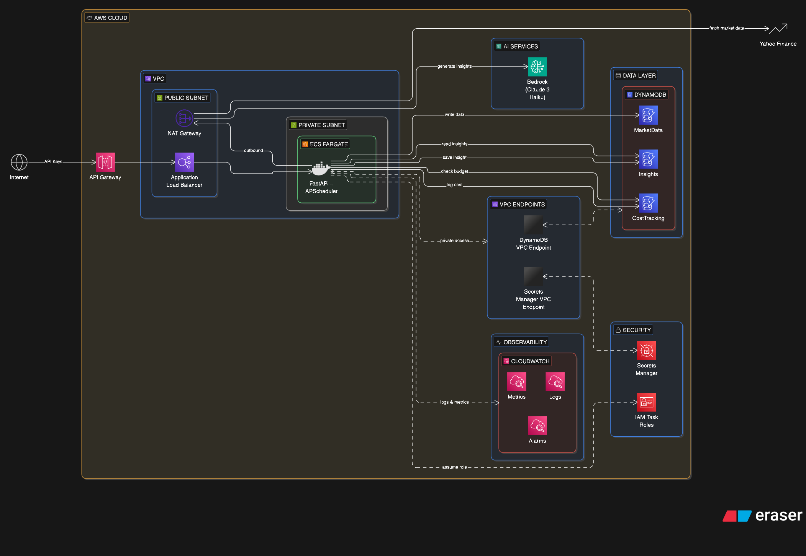

# Cost-Aware Market Insights Engine

A fully containerized Python (FastAPI) application designed to ingest stock market data, synthesize it using AI, and surface those insights on a premium frontend dashboard—all while rigorously enforcing strict financial guardrails (FinOps) to guarantee AI generation costs never exceed a daily budget.



## Overview & Architecture Highlights

This project is built around the fundamental philosophy that AI integration must be cost-aware from day one. It utilizes a **4-Phase Rollout Plan**, currently operating in **Phase 1: Fully Local MVP**.

1. **Data Ingestion (`yfinance`)**: An embedded APScheduler chron-job periodically fetches actual market ticks (open, high, low, close, volume) and top news headlines for a configured list of tickers (e.g., AAPL, MSFT, META).
2. **FinOps Engine (DynamoDB)**: Before any AI synthesis occurs, the engine precisely estimates the token-cost, queries a local `CostTracking` DynamoDB ledger, and physically blocks generation if it would breach your predefined `DAILY_BUDGET_USD` limit.
3. **Mock AI Synthesis**: In Phase 1, the AI generation is mocked to simulate cost impacts without actually reaching out to AWS Bedrock, allowing robust testing of the budget logic completely locally.
4. **Premium Dashboard**: A beautifully designed, glassmorphic UI served by FastAPI, displaying live real-time metrics for both Insight generation and Financial operation health.

For a deep dive into the system network design and future Cloud integration plans, review the full [System Design Documentation](./system-design/system_overview.md).

## System Requirements

- **Docker & Docker Compose**: The easiest way to spin up the local DynamoDB ledger alongside the application.
- **AWS Account**: Required for production deployment and invoking the **Amazon Bedrock (Anthropic Claude 3 Haiku)** models.
- **AWS CLI (`aws`)**: Must be configured with `aws configure` locally before running deployment scripts.
- **Python 3.9+**: Required if bypassing Docker and testing via `uvicorn` natively.
- **Model Subscriptions**: Ensure that you have requested access to `Anthropic Claude 3 Haiku` inside the AWS Bedrock console in your target region before going live.

## Quick Start (Running Locally)

To run the engine safely on your local machine (where AI synthesis will mock safely instead of hitting AWS):
1. **Clone the repository:**
   ```bash
   git clone https://github.com/Cost-Aware-Market-Insights-Engine.git
   cd Cost-Aware-Market-Insights-Engine
   ```

2. **Start the containers detached:**
   ```bash
   docker-compose up -d --build
   ```
   *This command spins up the backend Python container alongside an `amazon/dynamodb-local` container handling all local storage via standard AWS SDKs (boto3).*

3. **Verify Health:**
   Ensure the API is healthy and connected to local DynamoDB.
   ```bash
   curl http://localhost:8000/api/v1/health
   ```

4. **Access the FinOps Dashboard:**
   Open your browser to [http://localhost:8000](http://localhost:8000/)
   The embedded scheduler will automatically fetch real ticker prices, generate mocked AI insight responses, and chart the cost utilization to your screen.

## AWS Production Deployment

Once local testing is complete, deploying the full CloudFormation stack and ECS instances is seamless:

1. **Verify AWS CLI credentials** are loaded and map to your production account.
2. **Execute the Deployment Pipeline**:
   ```bash
   sh scripts/deploy.sh
   ```
   *This automatically builds the Docker Image, pushes it to your private ECR, runs `cloudformation.yml` to scaffold IAM/VPC/Dynamo tables, and forces the ECS Fargate cluster to reboot onto your new code.*

## Project Structure

```text
├── docker-compose.yml       # Local execution definitions mapping the API and DynamoDB
├── Dockerfile               # Multi-stage lightweight python environment
├── requirements.txt         # App dependencies (FastAPI, uvicorn, yfinance, boto3, etc.)
├── static/                  # Frontend single-page app containing HTML, vanilla CSS/JS
├── src/                     # Core application logic
│   ├── main.py              # Application entrypoint & scheduler execution
│   ├── config.py & models.py# Validation schemas
│   ├── clients/             # Local interfaces to AWS instances
│   ├── cost_tracking/       # Core FinOps logic and budget gates
│   ├── ingestion/           # yFinance market pulling mechanisms
│   ├── routes/              # Client-facing API endpoints
│   └── synthesis/           # Generative AI wrapper (Currently mocking functionality)
└── system-design/           # Deep-dive infrastructure diagrams and deployment roadmap
```

## Phased Rollout Roadmap
- **[COMPLETE] Phase 1**: Fully Local MVP - Built the architecture entirely on local hardware implementing mock Bedrock requests and a local Dynamo store to validate the FinOps architecture without spending a dime in actual AWS fees. 
- **[COMPLETE] Phase 2**: AWS Services Integration - Developed AWS CloudFormation templates to scaffold the VPC, ECR, and ECS Fargate cluster. Built Python logic utilizing `boto3` to hit Anthropics' Claude-3-Haiku. Run `./scripts/deploy.sh` to scaffold your AWS environment!
- **[PENDING] Phase 3**: Cost Control Hardening - Advancing FinOps to use CloudWatch Custom metrics and AWS alarms.
- **[PENDING] Phase 4**: Production Hardening - Locking down traffic using Private Subnets, NAT Gateways, ALBs, and robust VPC Endpoints.
