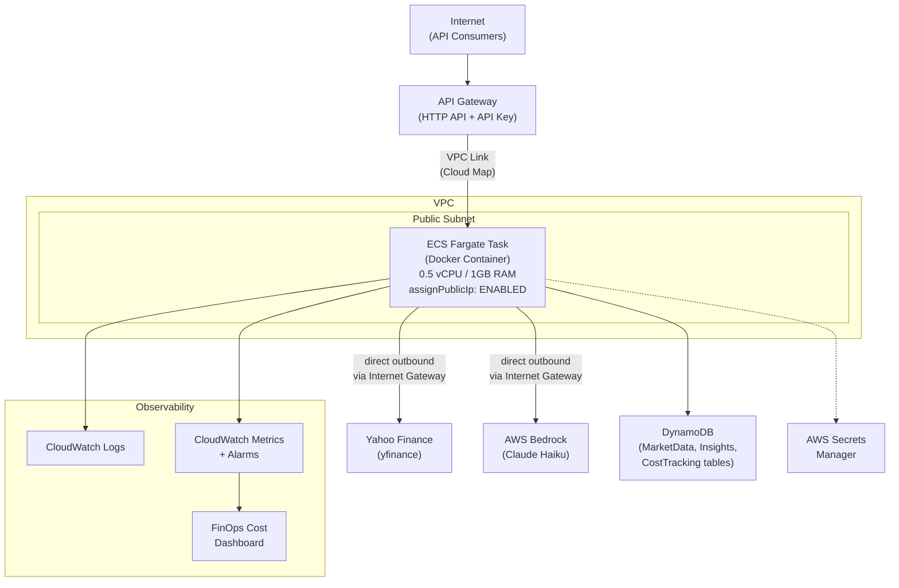
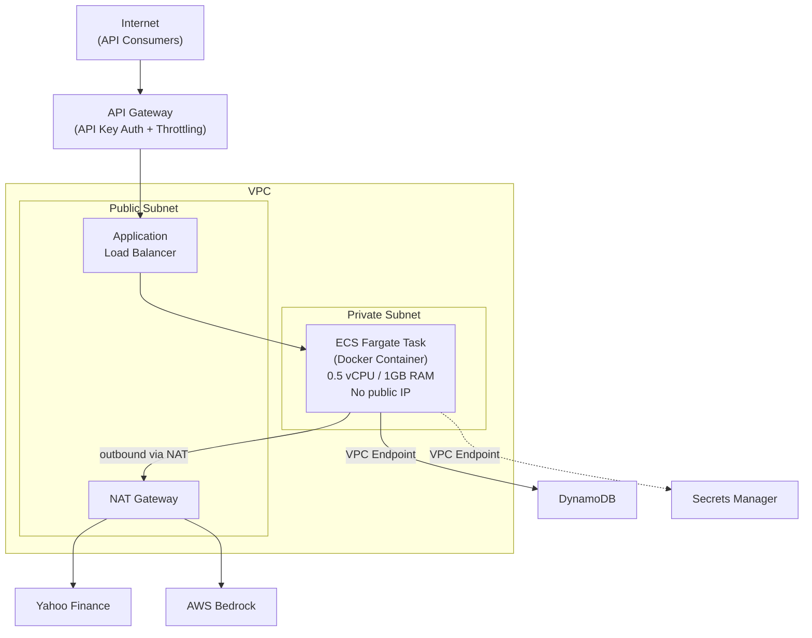
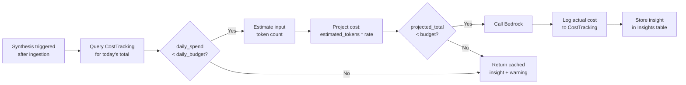
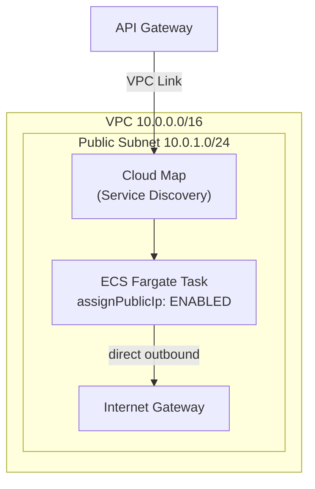
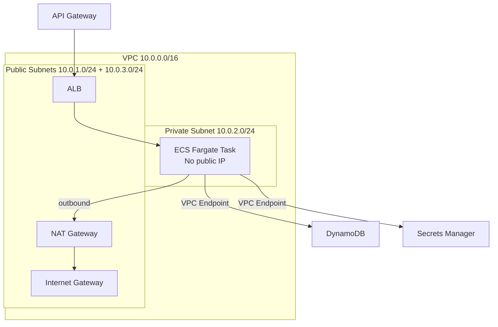

# Cost-Aware AI Market Insights Engine -- System Design & Implementation Plan

## Architecture Overview

A Dockerized Python (FastAPI) application running on **ECS Fargate**, persisting to **DynamoDB**, synthesizing insights via **AWS Bedrock**, and secured with **Secrets Manager** + least-privilege IAM -- all with rigorous AI cost tracking and budget enforcement.

Development is split into two architecture stages: **Phases 1-4** use a simplified public-subnet deployment to minimize cost during development, and **Phase 5** adds production-grade networking (private subnet, NAT Gateway, ALB).

#### Phases 1-4: Development Architecture (public subnet, no ALB/NAT)




**Phases 1-4 request flow:**

```
Internet --> API Gateway --> VPC Link (Cloud Map) --> Fargate (public subnet, public IP)
                                                        |
                                              Internet Gateway (direct)
                                                        |
                                              Yahoo Finance / Bedrock
```

The container runs in a **public subnet** with `assignPublicIp: ENABLED`. It reaches external services (Yahoo Finance, Bedrock) directly through the Internet Gateway -- no NAT Gateway needed. API Gateway connects to the Fargate task via **Cloud Map service discovery** and a **VPC Link**, eliminating the need for an ALB. A security group restricts inbound traffic to only the API Gateway VPC Link.

#### Phase 5: Production Architecture (private subnet + NAT + ALB)




Phase 5 migrates the Fargate task into a **private subnet** with no public IP. All outbound traffic routes through the **NAT Gateway**. Inbound traffic enters only through the **ALB**, fronted by API Gateway. VPC Endpoints for DynamoDB and Secrets Manager bypass the NAT for AWS service traffic.

---

## Phased Roadmap (ROADMAP.md)

Development follows 5 phases. Phases 1-4 use a cost-effective public-subnet deployment (~~$21/mo). Phase 5 adds production networking (~~$72/mo).

- **Phase 1 -- Dockerized Yahoo Finance Data Ingestion:** Scaffold the project, write the Dockerfile, implement yfinance data fetching with APScheduler, build FastAPI endpoints, verify everything works with `docker-compose up` locally.
- **Phase 2 -- Deploy to Cloud (ECS Fargate, public subnet):** Write CloudFormation for VPC (public subnet only), deploy to ECS Fargate with `assignPublicIp: ENABLED`, configure Secrets Manager, set up IAM least-privilege task roles, wire API Gateway via Cloud Map + VPC Link (no ALB needed).
- **Phase 3 -- Cloud AI Integration and Prompt Engineering:** Integrate AWS Bedrock (Claude Haiku), implement structured prompt construction with context window management, build the cost tracking and budget gate system.
- **Phase 4 -- FinOps Monitoring and Cost Dashboards:** Add CloudWatch custom metrics, alarms at budget thresholds, a FinOps cost dashboard endpoint in the API, structured logging with X-Ray tracing.
- **Phase 5 -- Production Networking and Security Hardening:** Add private subnet, NAT Gateway, ALB, migrate Fargate tasks to private subnet, add VPC Endpoints (DynamoDB, Secrets Manager), wire API Gateway through ALB, tighten security groups to remove public IP exposure.

---

## Component Details

### 1. Docker Container (The Compute)

- **Base image:** `python:3.12-slim`
- **Application:** Single FastAPI process with an embedded APScheduler for periodic data ingestion and synthesis.
- **Why a single container:** Data ingestion, AI synthesis, and API serving are all I/O-bound tasks that share the same data models and DynamoDB client. A single container with an async scheduler avoids inter-service communication complexity.

**Resource allocation (documented rationale):**

- **0.5 vCPU:** Data fetching (yfinance) and API relaying (Bedrock, DynamoDB) are I/O-bound, not CPU-bound. 0.5 vCPU is sufficient for async I/O workloads.
- **1 GB RAM:** `yfinance` + `pandas` + FastAPI runtime fits within ~512MB; 1GB provides headroom for concurrent requests and data buffering.
- **Cost estimate:** Fargate pricing in us-east-1: ~$0.04048/vCPU/hr + $0.004445/GB/hr = ~$0.025/hr = ~$18/month running 24/7. Can reduce by scaling to 0 outside market hours via scheduled ECS service scaling.

**Dockerfile structure:**

```dockerfile
FROM python:3.12-slim AS base
WORKDIR /app
COPY requirements.txt .
RUN pip install --no-cache-dir -r requirements.txt
COPY src/ ./src/
EXPOSE 8000
HEALTHCHECK CMD curl -f http://localhost:8000/api/v1/health || exit 1
CMD ["uvicorn", "src.main:app", "--host", "0.0.0.0", "--port", "8000"]
```

**docker-compose.yml (local development):**

- `app` service: builds from Dockerfile, maps port 8000, mounts source for hot reload
- `dynamodb-local`: Amazon DynamoDB Local for offline development
- Environment variables for local config (budget, tickers, region)

### 2. Scheduling -- APScheduler (In-Container)

- **Library:** APScheduler running inside the FastAPI application (`lifespan` event).
- **Jobs:**
  - `ingest_market_data`: Runs every 15 minutes, Mon-Fri, 9:30 AM - 4:00 PM ET.
  - `synthesize_insights`: Triggered after each successful ingestion run.
- **Mindful of:**
  - APScheduler uses the container's timezone -- set `TZ=America/New_York` in the container environment, or use UTC with explicit conversion.
  - Market holidays are not handled by cron alone -- the ingestion job should check a holiday calendar or simply validate that `yfinance` returns fresh data.
  - If the container restarts, APScheduler state is lost (acceptable -- it just picks up on the next cron tick).

### 3. Data Ingestion Service

- **Responsibilities:**
  - Accept a configured list of tickers (default: SPY, AAPL, MSFT, GOOGL, TSLA) from environment config.
  - Fetch current price data (open, high, low, close, volume, change%) via `yfinance`.
  - Fetch the top 5 recent news headlines for each ticker.
  - Normalize and write raw data to the **MarketData** DynamoDB table.
  - Trigger the synthesis service after successful ingestion.
- **Mindful of:**
  - `yfinance` is an unofficial wrapper -- Yahoo can change endpoints without notice. Pin the version and wrap all calls in try/except.
  - Implement retry with exponential backoff for transient failures.
  - Validate data freshness: compare returned timestamps to current time, skip stale data.
  - The container reaches Yahoo Finance via the NAT Gateway (outbound internet through the private subnet).

### 4. AI Synthesis Service

- **Responsibilities:**
  - Read latest market data from DynamoDB for all tracked tickers.
  - **Budget Gate check** (see Section 7): Query CostTracking for today's spend. If budget exceeded, skip AI call and serve cached insight.
  - Construct a structured prompt following this pattern:

```
    Given the following market data and news headlines for {date}:

    Ticker: AAPL
    Change: -2.3%
    Headlines:
    1. "Apple faces EU antitrust fine..."
    2. "iPhone sales decline in China..."
    ...

    Explain in 2-3 sentences why this stock is moving today.
    

```

- Call **AWS Bedrock** (`bedrock-runtime` / `InvokeModel`) using **Claude 3 Haiku** (~$0.25/M input, $1.25/M output tokens).
- Parse the response, extract token counts from response metadata.
- Write insight to the **Insights** table, cost record to the **CostTracking** table.
- **Context Window Management:**
  - Claude Haiku supports 200K tokens, but we target prompts under 2K tokens to minimize cost.
  - Set `max_tokens: 512` for output (2-3 sentences don't need more).
  - Use `temperature: 0.3` for deterministic, factual summaries.
- **Mindful of:**
  - Bedrock auth is via IAM (the Fargate task role) -- no API keys needed for the AI provider itself.
  - Bedrock responses include `inputTokenCount` and `outputTokenCount` in the response metadata -- use these for precise cost tracking.
  - Implement idempotency: hash the input data and skip re-synthesis if the hash matches the last run.
  - The container reaches Bedrock via the NAT Gateway (Bedrock is a public AWS endpoint). Alternatively, configure a **VPC Endpoint for Bedrock** to avoid NAT costs for this traffic.

### 5. FastAPI Application (The API)

- **Framework:** FastAPI with `uvicorn` ASGI server.
- **Endpoints:**
  - `GET /api/v1/insights` -- Latest insights for all tickers (query param `?ticker=AAPL` for filtering).
  - `GET /api/v1/insights/{ticker}` -- Latest insight for a specific ticker.
  - `GET /api/v1/costs` -- Today's cost summary (total spend, remaining budget, call count).
  - `GET /api/v1/costs/history` -- Historical daily cost breakdown (paginated).
  - `GET /api/v1/health` -- Health check (returns 200 + DynamoDB connectivity status).
  - `GET /api/v1/costs/dashboard` -- (Phase 4) FinOps summary with daily/weekly/monthly trends.
- **Auth:** API Gateway Usage Plan + API Key (passed via `x-api-key` header). The ALB itself is internal; API Gateway is the only public entry point.
- **Mindful of:**
  - FastAPI auto-generates OpenAPI/Swagger docs at `/docs` -- useful for testing but should be disabled or auth-gated in production.
  - Return proper HTTP status codes: 429 (budget exhausted / rate limited), 503 (ingestion failure), 200 with `generated_at` timestamp so consumers know insight freshness.

### 6. DynamoDB Tables -- Data Model & Storage Format

DynamoDB is a NoSQL document store. Each item is a JSON-like attribute map (key-value pairs). There is no rigid schema -- only the partition key and sort key are required. All other attributes are flexible per item. Data is accessed via `boto3` using the `dynamodb.Table` resource, which handles serialization between Python types and DynamoDB's native type system (String `S`, Number `N`, List `L`, Map `M`, etc.).

**MarketData Table**

- Partition key: `ticker` (String)
- Sort key: `timestamp` (String, ISO-8601)
- TTL attribute: `ttl` (Number, Unix epoch) -- auto-expire after 30 days

Example item:

```json
{
  "ticker": "AAPL",
  "timestamp": "2026-03-13T10:30:00Z",
  "open": 178.52,
  "high": 179.10,
  "low": 175.83,
  "close": 176.20,
  "volume": 42318900,
  "change_pct": -2.3,
  "headlines": [
    "Apple faces EU antitrust fine of $500M",
    "iPhone sales decline 8% in China market",
    "Apple Vision Pro 2 rumors surface ahead of WWDC",
    "Warren Buffett trims Apple stake by 2%",
    "App Store revenue hits record despite regulatory pressure"
  ],
  "data_hash": "a1b2c3d4e5f6",
  "ttl": 1744540200
}
```

**Insights Table**

- Partition key: `ticker` (String)
- Sort key: `timestamp` (String, ISO-8601)
- GSI: `latest-insight-index` -- PK=`ticker`, SK=`generated_at` for fast "get latest" queries
- TTL attribute: `ttl` (Number, Unix epoch) -- auto-expire after 90 days

Example item:

```json
{
  "ticker": "AAPL",
  "timestamp": "2026-03-13T10:30:15Z",
  "insight_text": "Apple shares dropped 2.3% today, primarily driven by a reported 8% decline in iPhone sales in China and news of a potential $500M EU antitrust fine. Investor sentiment was further dampened by reports that Berkshire Hathaway trimmed its Apple position, though strong App Store revenue provided a partial counterbalance.",
  "model_used": "anthropic.claude-3-haiku-20240307-v1:0",
  "input_tokens": 1247,
  "output_tokens": 189,
  "cost_usd": 0.000548,
  "data_hash": "a1b2c3d4e5f6",
  "generated_at": "2026-03-13T10:30:15Z",
  "ttl": 1749724215
}
```

**CostTracking Table**

- Partition key: `date` (String, YYYY-MM-DD)
- Sort key: `request_id` (String, UUID)
- GSI: `daily-summary-index` -- PK=`date` for aggregation queries (sum of `cost_usd` for all items on a given date)

Example item:

```json
{
  "date": "2026-03-13",
  "request_id": "f47ac10b-58cc-4372-a567-0e02b2c3d479",
  "ticker": "AAPL",
  "model": "anthropic.claude-3-haiku-20240307-v1:0",
  "input_tokens": 1247,
  "output_tokens": 189,
  "estimated_cost_usd": 0.000520,
  "actual_cost_usd": 0.000548,
  "timestamp": "2026-03-13T10:30:15Z"
}
```

**How data flows through the tables:**

1. Ingestion writes raw market data to **MarketData** (one item per ticker per run).
2. Synthesis reads from MarketData, calls Bedrock, writes the AI-generated text to **Insights** (one item per ticker per run) and the cost record to **CostTracking** (one item per Bedrock call).
3. The API reads from **Insights** (serve to consumers) and **CostTracking** (budget/spend queries).

**Billing:** All tables use **on-demand (PAY_PER_REQUEST)** mode -- no capacity planning needed, pay only for actual reads/writes. At our scale (~5 tickers, ~26 runs/day), this costs essentially nothing (see cost estimate below).

### 7. Cost Control System (The Core Differentiator)




- **Budget config** stored in environment variables (injected via Secrets Manager or task definition): `DAILY_BUDGET_USD=5.00`, `MONTHLY_BUDGET_USD=100.00`.
- **Pre-call estimation:** Count prompt characters, estimate tokens (~4 chars/token), multiply by model rate.
- **Post-call logging:** Record actual tokens from Bedrock response metadata. Calculate `cost_usd = (input_tokens * input_rate) + (output_tokens * output_rate)`.
- **Alerts (Phase 4):** CloudWatch Alarm on custom metric `DailyAICost` -- trigger SNS notification at 80% and 100% thresholds.
- **API exposure:** The `/costs` endpoint lets consumers see current spend, remaining budget, and per-request cost breakdown.

### 8. Networking & Security (The Fortress)

#### Phases 1-4: Public Subnet Deployment




- **VPC:** `10.0.0.0/16` with DNS support enabled.
- **Public subnet:** `10.0.1.0/24` -- hosts the Fargate task with a public IP assigned. Route table points to the Internet Gateway.
- **No NAT Gateway, no ALB** -- the Fargate task has a public IP and reaches external services directly.
- **Cloud Map:** ECS service registers with Cloud Map for service discovery. API Gateway connects via a VPC Link using the Cloud Map service, eliminating the need for an ALB.
- **Security Group (Fargate):** Inbound 8000 from the API Gateway VPC Link only. Outbound 443 to `0.0.0.0/0` (for Yahoo Finance, Bedrock, DynamoDB, Secrets Manager).
- **Trade-off:** The container has a public IP, which is less secure than a private subnet. Acceptable during development; hardened in Phase 5.

#### Phase 5: Private Subnet Production Deployment




- **Private subnet:** `10.0.2.0/24` -- Fargate task moves here, no public IP. Default route to NAT Gateway.
- **Public subnets:** `10.0.1.0/24` + `10.0.3.0/24` (two AZs, required by ALB) -- hosts ALB and NAT Gateway.
- **ALB:** Replaces Cloud Map/VPC Link. API Gateway fronts the ALB.
- **NAT Gateway:** Enables outbound internet access (Yahoo Finance, Bedrock) from the private subnet.
- **Security Groups:**
  - ALB SG: Inbound 443 from API Gateway. Outbound 8000 to Fargate SG.
  - Fargate SG: Inbound 8000 from ALB SG only. Outbound 443 to `0.0.0.0/0`.
- **VPC Endpoints (cost optimization):**
  - DynamoDB Gateway Endpoint: **Free**, avoids NAT data processing charges.
  - Secrets Manager Interface Endpoint: ~$7.30/mo, avoids NAT charges for secret fetches.
  - Bedrock Interface Endpoint (optional): ~$7.30/mo, evaluate if traffic justifies cost.

#### IAM -- Least Privilege Task Role (all phases)

- `dynamodb:PutItem`, `dynamodb:GetItem`, `dynamodb:Query` on the 3 specific table ARNs only.
- `bedrock:InvokeModel` on the specific Claude Haiku model ARN only.
- `secretsmanager:GetSecretValue` on the specific secret ARN only.
- `logs:CreateLogStream`, `logs:PutLogEvents` for CloudWatch logging.
- No `*` wildcards. No admin access.

#### Secrets Manager (all phases)

- Stores any future external API keys (Bedrock is IAM-authenticated, so no secret needed for it today).
- The container fetches secrets at startup via `boto3` -- never stored in code, Dockerfile, or environment variables.
- Useful for: API Gateway key rotation, any future third-party data source credentials.

### 9. Observability & FinOps (Phase 4)

- **CloudWatch Logs:** Structured JSON logging from the container (use Python `structlog` or `aws-lambda-powertools` logging module).
- **CloudWatch Container Insights:** Enable on the ECS cluster for CPU/memory/network metrics.
- **Custom CloudWatch Metrics (via `boto3` PutMetricData):**
  - `InsightsGenerated` (count)
  - `DailyAICost` (USD)
  - `BudgetUtilizationPct` (percentage)
  - `IngestionErrors` (count)
  - `IngestionLatencyMs` (milliseconds)
- **CloudWatch Alarms:**
  - Budget threshold breaches (80%, 100%)
  - Ingestion failures > 3 consecutive
  - Container health check failures
- **FinOps Cost Dashboard:** `/api/v1/costs/dashboard` endpoint returning daily/weekly/monthly spend breakdown, projected monthly cost, cost-per-insight metric.

### 10. Project Structure

```
market-insights-engine/
├── Dockerfile                        # Multi-stage Docker build
├── docker-compose.yml                # Local dev (app + DynamoDB Local)
├── requirements.txt                  # All Python dependencies
├── ROADMAP.md                        # Phased delivery roadmap
├── README.md                         # Project overview + setup instructions
├── infrastructure/
│   └── cloudformation.yaml           # VPC, ECS, ALB, DynamoDB, IAM, Secrets
├── src/
│   ├── __init__.py
│   ├── main.py                       # FastAPI app + APScheduler setup
│   ├── config.py                     # Environment config loader
│   ├── models.py                     # Pydantic data models
│   ├── ingestion/
│   │   ├── __init__.py
│   │   └── service.py                # yfinance data fetch + DynamoDB write
│   ├── synthesis/
│   │   ├── __init__.py
│   │   ├── service.py                # Bedrock invocation + insight storage
│   │   └── prompts.py                # Prompt templates
│   ├── cost_tracking/
│   │   ├── __init__.py
│   │   └── service.py                # Budget gate, cost logging, estimation
│   ├── routes/
│   │   ├── __init__.py
│   │   ├── insights.py               # /insights endpoints
│   │   ├── costs.py                  # /costs + /costs/dashboard endpoints
│   │   └── health.py                 # /health endpoint
│   └── clients/
│       ├── __init__.py
│       ├── dynamo.py                 # DynamoDB client helpers
│       ├── bedrock.py                # Bedrock client wrapper
│       └── secrets.py                # Secrets Manager client
├── tests/
│   ├── unit/
│   │   ├── test_ingestion.py
│   │   ├── test_synthesis.py
│   │   ├── test_cost_tracker.py
│   │   └── test_api.py
│   └── integration/
│       └── test_e2e.py
└── .github/
    └── workflows/
        └── deploy.yml                # CI/CD: test, docker build, push ECR, deploy
```

### 11. Infrastructure as Code (CloudFormation)

The `infrastructure/cloudformation.yaml` will define all AWS resources, parameterized to support both development (Phases 1-4) and production (Phase 5) modes.

**Phases 1-4 resources:**

- **Networking:** VPC, 1 public subnet, Internet Gateway, route table
- **Compute:** ECS Cluster, Fargate Service (assignPublicIp: ENABLED), Task Definition (0.5 vCPU, 1GB RAM), ECR Repository
- **Service Discovery:** Cloud Map namespace + service (for API Gateway VPC Link)
- **Storage:** 3 DynamoDB tables (MarketData, Insights, CostTracking) with GSIs and TTL
- **Security:** Fargate Task IAM Role (least-privilege), Task Execution Role, Security Group (Fargate), Secrets Manager secret
- **API:** API Gateway (HTTP API) with VPC Link to Cloud Map, Usage Plan + API Key
- **Monitoring:** CloudWatch Log Group, CloudWatch Alarms (budget, health), SNS Topic for alerts

**Phase 5 additions (via CloudFormation parameters or a separate stack):**

- **Networking:** Second public subnet (AZ2), private subnet, NAT Gateway, updated route tables, DynamoDB Gateway Endpoint, Secrets Manager Interface Endpoint
- **Compute:** Migrate Fargate to private subnet, remove assignPublicIp
- **Load Balancing:** ALB + Target Group + Listener, ALB Security Group
- **API:** Switch API Gateway from VPC Link/Cloud Map to ALB integration

CloudFormation chosen over Terraform for: native AWS integration, no state file management, and direct integration with ECS/Fargate deployment.

### 12. Key Risks and Mitigations

- **yfinance reliability:** Unofficial API can break without notice. **Mitigation:** Pin version, wrap in try/except, alert on consecutive failures, abstract behind an interface for future swap to a paid data source.
- **Bedrock model availability:** Not all models available in all regions. **Mitigation:** Deploy to `us-east-1` where Bedrock has broadest model support. Parameterize model ID in config.
- **Container cold start:** If ECS scales from 0 to 1 task, startup takes 30-60s. **Mitigation:** Keep `desiredCount: 1` during market hours; scale to 0 only overnight/weekends.
- **Public IP exposure (Phases 1-4):** Container has a public IP in the public subnet. **Mitigation:** Security group restricts inbound to API Gateway VPC Link only. No SSH, no other ports open. Hardened in Phase 5.
- **DynamoDB hot partitions:** All reads hitting the same popular tickers. **Mitigation:** On-demand billing mode handles burst well. Only 5 tickers, so partition spread is fine.
- **Cost overrun from Bedrock:** Runaway synthesis loop could burn budget. **Mitigation:** Budget gate is the primary defense. Additionally, set Bedrock service quotas as a hard backstop.
- **NAT Gateway cost (Phase 5):** NAT Gateway charges $0.045/hr ($33/month) + data processing fees. **Mitigation:** Use VPC Gateway Endpoint for DynamoDB (free). Consider keeping the Cloud Map + VPC Link approach instead of ALB if low traffic persists.

### 13. Monthly AWS Cost Estimate (us-east-1)

Assumptions: 5 tickers, ingestion every 15 min during market hours (6.5 hrs/day, 22 trading days/month = 572 runs/month), low API consumer traffic (10,000 requests/month).

#### Per-Service Breakdown

**Compute -- ECS Fargate**

- 0.5 vCPU at $0.04048/hr = $14.78/mo (24/7)
- 1 GB RAM at $0.004445/hr = $3.24/mo (24/7)
- **Subtotal: $18.02/mo** running 24/7
- Optimized (market hours only, 143 hrs/mo): $3.53/mo

**Networking -- NAT Gateway** (Phase 5 only)

- Hourly charge: $0.045/hr x 730 hrs = $32.85/mo
- Data processing: $0.045/GB x 2 GB = $0.09/mo
- **Subtotal: $32.94/mo** (runs 24/7 regardless of traffic)

**Networking -- Application Load Balancer** (Phase 5 only)

- Base charge: $0.0225/hr x 730 hrs = $16.43/mo
- LCU charges at low traffic: $1-2/mo
- **Subtotal: $18.00/mo**

**AI -- AWS Bedrock (Claude 3 Haiku)**

- Input tokens: 1,500 tokens/request x 572 runs = 858K tokens/mo x $0.00025/1K = $0.21/mo
- Output tokens: 200 tokens/request x 572 runs = 114K tokens/mo x $0.00125/1K = $0.14/mo
- **Subtotal: $0.35/mo** (with $5/day budget cap as safety net = max $110/mo)

**Storage -- DynamoDB (on-demand)**

- Write requests: 2,860 writes/mo (5 tickers x 572 runs) x $1.25/million = $0.004/mo
- Read requests: 10,000 API reads/mo x $0.25/million = $0.003/mo
- Storage: less than 1 MB total = $0.00/mo
- **Subtotal: $0.01/mo** (essentially free at this scale)

**API Gateway (HTTP API)**

- API calls: 10,000 requests/mo x $1.00/million = $0.01/mo
- **Subtotal: $0.01/mo**

**Cloud Map (Phases 1-4, replaced by ALB in Phase 5)**

- Service discovery: $0.10/mo per namespace + $0.10 per million queries
- **Subtotal: $0.10/mo**

**Secrets Manager**

- 1 secret x $0.40/secret/mo = $0.40
- API calls: $0.05/mo
- **Subtotal: $0.45/mo**

**CloudWatch**

- Log ingestion: 1 GB/mo x $0.50/GB = $0.50
- Custom metrics: 5 metrics x $0.30/metric = $1.50
- Alarms: 3 alarms x $0.10/alarm = $0.30
- **Subtotal: $2.30/mo**

**ECR (Container Registry)**

- Image storage: 500 MB x $0.10/GB = $0.05/mo
- **Subtotal: $0.05/mo**

**VPC Endpoints (Phase 5, optional cost savers)**

- DynamoDB Gateway Endpoint: **FREE** (saves NAT data processing fees)
- Secrets Manager Interface Endpoint: $7.30/mo
- Bedrock Interface Endpoint: $7.30/mo

---

#### Phases 1-4: Development Cost (public subnet, no ALB, no NAT)


| Service         | Always-On 24/7 | Market-Hours Only |
| --------------- | -------------- | ----------------- |
| ECS Fargate     | $18.02         | $3.53             |
| Bedrock (AI)    | $0.35          | $0.35             |
| DynamoDB        | $0.01          | $0.01             |
| API Gateway     | $0.01          | $0.01             |
| Cloud Map       | $0.10          | $0.10             |
| Secrets Manager | $0.45          | $0.45             |
| CloudWatch      | $2.30          | $2.30             |
| ECR             | $0.05          | $0.05             |
| **TOTAL**       | **$21/mo**     | **$7/mo**         |


#### Phase 5: Production Cost (private subnet + NAT + ALB)


| Service         | Always-On 24/7 | Market-Hours Only |
| --------------- | -------------- | ----------------- |
| ECS Fargate     | $18.02         | $3.53             |
| NAT Gateway     | $32.94         | $32.94            |
| ALB             | $18.00         | $18.00            |
| Bedrock (AI)    | $0.35          | $0.35             |
| DynamoDB        | $0.01          | $0.01             |
| API Gateway     | $0.01          | $0.01             |
| Secrets Manager | $0.45          | $0.45             |
| CloudWatch      | $2.30          | $2.30             |
| ECR             | $0.05          | $0.05             |
| **TOTAL**       | **$72/mo**     | **$58/mo**        |


**Key takeaway:** By deferring NAT Gateway ($33/mo) and ALB ($18/mo) to Phase 5, development runs at just **$21/mo** (or **$7/mo** with market-hours scaling) -- a $51/mo saving. The actual variable costs (Bedrock at $0.35/mo, DynamoDB at $0.01/mo) are negligible. The dominant cost during development is the Fargate task itself.

**Cost reduction levers:**

- **Scale Fargate to 0** outside market hours via ECS Scheduled Scaling -- saves $14.50/mo (biggest lever in Phases 1-4).
- **AWS Free Tier** (first 12 months): DynamoDB gets 25 GB + 25 WCU/RCU free, API Gateway gets 1M HTTP API calls/mo free.
- In Phase 5: Use **VPC Endpoints** for DynamoDB (free) and Secrets Manager ($7.30/mo) to reduce NAT data processing fees.
- In Phase 5: Consider keeping Cloud Map + VPC Link instead of ALB to save $18/mo permanently if traffic stays low.

