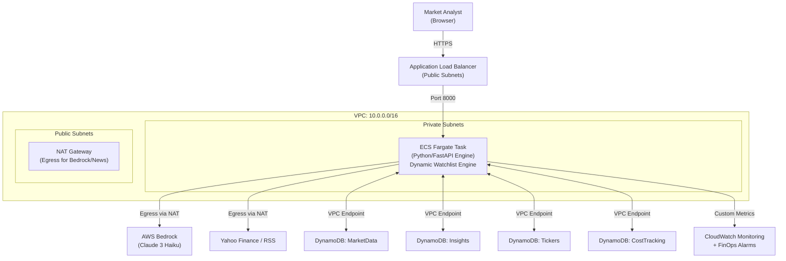

# AI Market Insights Engine -- Final System Architecture

## Final Production State (As of 2026-04-13)

### 1. High-Level Architecture
The system has evolved from a static containerized service to a fully dynamic, event-driven intelligence engine running on **AWS ECS Fargate**.

### 2. Significant Implementation Pivots
During development, the following architectural shifts were made to improve UX and scalability:

| Feature | Initial Design (Static) | Final Evolution (Dynamic) |
| :--- | :--- | :--- |
| **Ticker Management** | Hardcoded `config.py` environment variables. | **DynamoDB-Backed Watchlist**: Tickers managed live via UI/API. |
| **AI Synthesis Loop** | Fixed 15-minute background job. | **Hybrid Logic**: 5-minute background cron + **Fast-Path Sync** for new assets. |
| **Cost Estimation** | Static placeholder values. | **Dynamic Calibration**: $0.0002 baseline projection synced with Haiku real-world usage. |
| **Dashboard Layout** | Unified single-page view. | **Tabbed "Insights-First" UI**: Dedicated views for Market Analysis vs. FinOps. |

### 3. Component Updates

#### A. The Watchlist Engine (`Tickers` Table)
A late-stage pivot introduced a fourth DynamoDB table. This allowed the engine to scale its ingestion and synthesis logic based on user-tracked assets in real-time.

#### B. The Synthesis Fast-Path
To prevent the "Awaiting AI Synthesis" lag, we decoupled the synthesis logic. When a user tracks a new ticker:
1. The engine fetches market data immediately.
2. It triggers a `synthesize_single_insight` call synchronously.
3. The background 5-minute cron then maintains the data freshness for that asset.

#### C. FinOps & Observability
- **Budget Gate**: Every AI call is gated by a sub-cent cost projection ($0.0002/run).
- **Alarms**: SNS-linked CloudWatch alarms trigger at 80% and 100% of the $5.00 daily threshold.
- **Metrics**: Custom metrics track `InsightsGenerated` and `DailyAICost` with 1-minute granularity.

### 4. Networking Hardening
The application is fully isolated in a **Private Subnet**.
- **Inbound**: Only via the Application Load Balancer.
- **Outbound**: All non-AWS traffic (Google News, Yahoo Finance) routes through the NAT Gateway.
- **Internal**: DynamoDB traffic stays within the AWS backbone via **VPC Gateway Endpoints** (Cost $0.00).

---
*End of Development - Managed by Antigravity*
