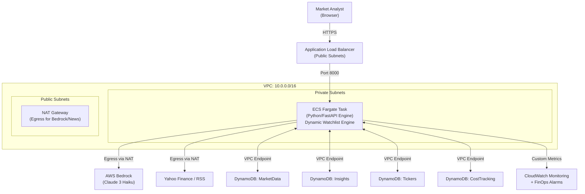

# AI Market Insights Engine -- Final System Architecture

## Final Production State (As of 2026-04-13)

### 1. High-Level Architecture
The system has evolved from a static containerized service to a fully dynamic, event-driven intelligence engine running on **AWS ECS Fargate**.

### 2. Significant Implementation Pivots
During development, the following architectural shifts were made to improve UX and scalability:

| Feature | Initial Design (Static) | Final Evolution (Dynamic) |
| :--- | :--- | :--- |
| **Ticker Management** | Hardcoded `config.py` environment variables. | **DynamoDB-Backed Watchlist**: Tickers managed live via UI/API. |
| **AI Synthesis Loop** | Fixed 15-minute background job. | **Hybrid Logic**: 5-minute background cron + **Fast-Path Sync** for new assets. |
| **Cost Estimation** | Static placeholder values. | **Dynamic Calibration**: $0.0002 baseline projection synced with Haiku real-world usage. |
| **Dashboard Layout** | Unified single-page view. | **Tabbed "Insights-First" UI**: Dedicated views for Market Analysis vs. FinOps. |

### 3. Component Updates

#### A. The Watchlist Engine (`Tickers` Table)
A late-stage pivot introduced a fourth DynamoDB table. This allowed the engine to scale its ingestion and synthesis logic based on user-tracked assets in real-time.

#### B. The Synthesis Fast-Path
To prevent the "Awaiting AI Synthesis" lag, we decoupled the synthesis logic. When a user tracks a new ticker:
1. The engine fetches market data immediately.
2. It triggers a `synthesize_single_insight` call synchronously.
3. The background 5-minute cron then maintains the data freshness for that asset.

#### C. FinOps & Observability
- **Budget Gate**: Every AI call is gated by a sub-cent cost projection ($0.0002/run).
- **Alarms**: SNS-linked CloudWatch alarms trigger at 80% and 100% of the $5.00 daily threshold.
- **Metrics**: Custom metrics track `InsightsGenerated` and `DailyAICost` with 1-minute granularity.

### 4. Networking Hardening
The application is fully isolated in a **Private Subnet**.
- **Inbound**: Only via the Application Load Balancer.
- **Outbound**: All non-AWS traffic (Google News, Yahoo Finance) routes through the NAT Gateway.
- **Internal**: DynamoDB traffic stays within the AWS backbone via **VPC Gateway Endpoints** (Cost $0.00).

---

### 5. Phase 2: Alpha-DAG Architecture
As of **May 2026**, the system was upgraded to a distributed, multi-agent model utilizing **LangGraph** and the **Model Context Protocol (MCP)**.

#### Distributed Orchestration
The monolithic `APScheduler` was replaced by a LangGraph Directed Acyclic Graph (DAG). The FastAPI server now acts as a client to the LangGraph Orchestrator (The Host). 

#### MCP Isolation Strategy
To maintain strict security and execution isolation (Non-Negotiable Constraints), external capabilities are decoupled into independent MCP servers:
1. **Market Data MCP Server**: Encapsulates `yfinance` logic and Google News RSS parsing.
2. **Quant Compute MCP Server**: A heavily isolated, network-restricted Docker container running Pandas/Numpy to execute quantitative calculations. It is completely insulated from AWS credentials.

#### FinOps Interceptor Node
The DAG executes a **FinOps Pre-Flight Gate** as its first node. Before any Bedrock calls are made, this node estimates token costs, reads the `CostTracking` DynamoDB ledger, and physically halts the graph execution if the `$5.00` daily budget is breached, guaranteeing zero unexpected spend.

---

### 6. Phase 3: Daily Discovery Agent
As part of the shift to autonomous workflows, the platform now runs a **Daily Discovery Agent** at 8:00 AM AEST.
- **Universe Scan**: Evaluates 20 distinct assets (S&P 500 stalwarts vs volatile Hidden Gems).
- **Quant Calculation**: Downloads bulk historical data to calculate annualized volatility and momentum.
- **AI Selection**: Prompts Bedrock to determine the optimal "Ticker to Watch" for both categories and persists them to the dashboard's new dynamic banner.

---

### 7. Phase 4: Global QMJ Screener
As of **May 2026**, the system integrated an "Open Data Lakehouse" architecture to run a quantitative "Quality Minus Junk" (QMJ) screener.

#### Open Data Lakehouse
- **Data Ingestion**: The Market Data MCP was extended to pull fundamental financial statements (Income Statement, Balance Sheet, Cash Flow) and persist them as flattened JSON objects in a Bronze Data Lake layer (S3 for production, local `scratch/bronze/` for development).
- **dbt Core Transformation**: 
  - **Local Development**: Uses **DuckDB** to execute transformations over local JSON files with zero cloud cost.
  - **Production**: Uses **AWS Athena** over the S3 Data Lake to provide serverless, scale-out analytics.
- **QMJ Model**:
  - Computes composite QMJ metrics: Profitability (ROE, ROA, Cash Flow Margin) and Safety (Leverage Ratio).
  - Normalizes scores on a 0-100 scale using `PERCENT_RANK`.
  - The FastAPI backend accesses the final Data Mart via `duckdb` (local) or `pyathena` (cloud) and exposes it to a dedicated frontend dashboard tab.
