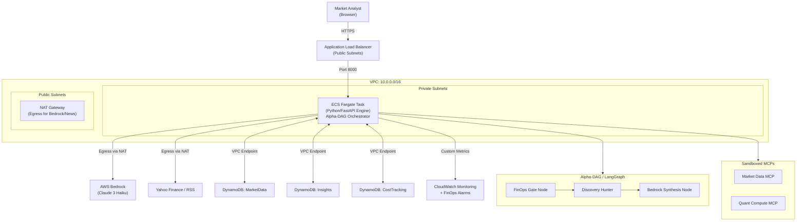

# AI Market Insights Engine -- Final System Architecture

## Final Production State (Phase 8 Complete)
**Status:** Institutional-Grade QMJ Screener & Alpha-DAG Pivot [COMPLETE]

### 1. High-Level Architecture
The system has evolved from a monolithic background loop to a **stateful, agentic discovery engine** orchestrated via **LangGraph**. It combines institutional-grade factor analysis (QMJ) with cost-aware AI synthesis.



### 2. Tangible Milestones & Roadmap

| Phase | Milestone | Features | Status |
| :--- | :--- | :--- | :--- |
| **1-5** | **Infrastructure & MVP** | ECS Fargate, DynamoDB, Bedrock, FinOps Budget Gate. | **Complete** |
| **6** | **Alpha-DAG Pivot** | LangGraph Orchestration, State-Aware Discovery, Sandboxed MCPs. | **Complete** |
| **7** | **Multi-Universe Ingestion** | S&P 500 + ASX Universes, dbt Pipeline, DuckDB Analytics. | **Complete** |
| **8** | **Institutional QMJ Screener** | Quality-Minus-Junk Metrics, Z-Scores, Force Refresh Engine, UI Polish. | **Complete** |
| **9** | **Sentiment Agent** | Alternative Data (Reddit/X), NLP Trend Detection. | **Planned** |
| **10** | **Portfolio & Risk** | Portfolio Optimization, Risk Parity Analysis. | **Planned** |

### 3. Advanced Engine Architecture

#### A. Alpha-DAG Intelligence (LangGraph)
The core intelligence is orchestrated via a stateful Directed Acyclic Graph (DAG) replacing legacy background loops.
- **FinOps Gate Node**: Heuristic check of spend vs budget ($5.00/day threshold) before any LLM invocation.
- **Discovery Hunter**: Autonomous daily search for value across global tickers.
- **Synthesis Node**: Claude 3 Haiku via Bedrock for narrative generation with temperature calibration (0.3).
- **State Persistence**: DAG state is saved to DynamoDB for "resume-from-checkpoint" reliability.

#### B. Institutional QMJ Screener
The **Quality Minus Junk (QMJ)** engine implements the AQR factor strategy to rank stocks across universes.
- **Three Pillars of Quality**:
    - **Profitability**: GPOA, ROE, and Gross Margin.
    - **Growth**: 5-year growth in profitability metrics.
    - **Safety**: Volatility, Leverage, and Bankruptcy risk (O-Score).
- **Transformation Pipeline**: Managed via `dbt`, transforming raw fundamental data into normalized Z-scores.
- **Multi-Universe**: Separate logic for **S&P 500 (US)** and **ASX (Australia)**.
- **Warehouse client**: Uses DuckDB for low-latency local dashboard analytics and Athena for production historical runs.

#### C. Force Refresh Engine
- **Throttling**: Integrated a global "Force Refresh" button with a 30-second client-side cooldown to manage data ingestion load.
- **Scope**: Refreshes ticker prices and news headlines without triggering expensive QMJ re-calculations (only quarterly).

### 4. Component Isolation (MCP)
To maintain security and execution isolation, external capabilities are decoupled into independent **Model Context Protocol (MCP)** servers:
1. **Market Data MCP**: Encapsulates `yfinance` logic and Google News RSS parsing.
2. **Quant Compute MCP**: A network-restricted Docker container running Pandas/Numpy for heavy math, completely insulated from AWS credentials.

### 5. Project Structure
```text
market-insights-engine/
├── Dockerfile                        # Multi-stage Docker build
├── infra/                            # CloudFormation & Deployment configs
├── system-design/                    # Diagrams & System Overviews
├── dev-blog/                         # Architectural decision logs
├── src/
│   ├── main.py                       # FastAPI entry point
│   ├── dag/                          # LangGraph state machine & nodes
│   ├── dbt_qmj/                      # dbt models for Quality-Minus-Junk
│   ├── mcp/                          # MCP servers (Quant, Market)
│   ├── cost_tracking/                # FinOps Budget Gate
│   ├── routes/                       # API Endpoints (Insights, Screener, Costs)
│   ├── clients/                      # AWS (Dynamo, Bedrock) & Warehouse (DuckDB)
│   └── models.py                     # Pydantic data schemas
└── static/                           # Glassmorphic Frontend Dashboard
```

### 6. Networking & Security
- **Private Subnet**: The application is fully isolated; no public IP is assigned to the Fargate container.
- **Inbound**: Traffic permitted only from the Application Load Balancer (ALB).
- **Outbound**: All external traffic (Yahoo Finance, News) routes via a **NAT Gateway**.
- **Internal**: DynamoDB traffic stays within the AWS backbone via **VPC Gateway Endpoints** (Cost: $0.00).
